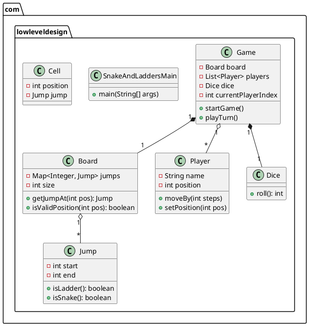
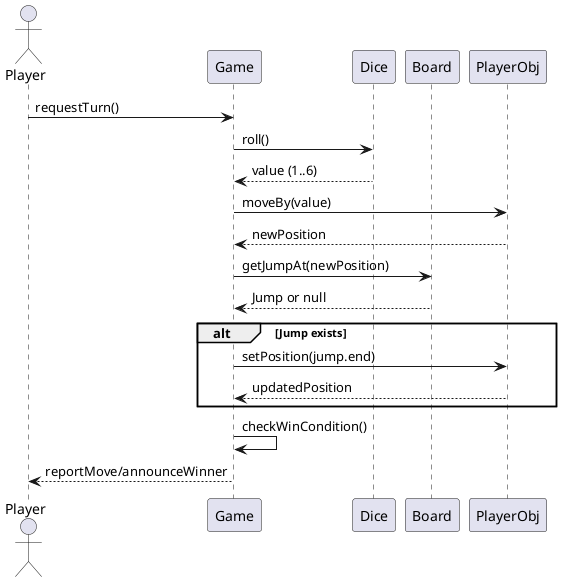

# Snake and Ladders — Low Level Design

This document describes the low-level design for the Snake and Ladders implementation in this repository. It includes functional requirements, class responsibilities, and UML diagrams (PlantUML source included) to help visualize the design.

## Plan / Checklist

- [x] Provide a short project overview
- [x] List functional requirements and user stories
- [x] Explain main classes and responsibilities (mapping to source files)
- [x] Add UML artifacts: class diagram and a sequence diagram (PlantUML)
- [x] Provide instructions to render the diagrams and run the module

## Project overview

A simple console-based implementation of the classic Snake and Ladders board game. The game supports multiple players who take turns rolling a dice and moving their tokens across the board. If a player lands on the head of a snake, they move down; if they land at the bottom of a ladder, they climb up. The first player to reach the last cell wins.

This module contains a minimal design focusing on clarity and separation of concerns. The key classes are: `Game`, `Board`, `Cell`, `Jump`, `Player`, and `Dice`.

## Functional requirements

1. Game setup
   - The board must be initializable with a configurable size (default 100 cells: 1..100).
   - Support placing snakes and ladders (jumps) at specified positions; each jump has a start and end cell.
2. Players
   - Support 2 or more players.
   - Each player has a name and a current position on the board (starting at cell 1 or 0 depending on implementation choice).
3. Turn and dice
   - On a player's turn, they roll a (single) dice which returns a value between 1 and 6.
   - A player's token moves forward by the dice value.
4. Jumps (snake or ladder)
   - After moving, if the player lands on a cell that is the start of a jump, the player is moved to the jump's end cell.
   - Jumps may move a player up (ladder) or down (snake).
5. Winning condition
   - A player who reaches the final cell (board size) exactly wins the game.
   - If a roll overshoots the final cell, common variants either keep the player in place or bounce back; document the chosen behavior (this implementation keeps it simple and requires an exact roll to win).
6. Game loop
   - Players take turns in a fixed order until a winner is found.
7. Input/Output
   - Minimal console I/O for demonstration (roll outcome, player moves, jumps encountered, winner announcement).

## Non-functional requirements (brief)

- Simplicity and clarity over optimization.
- Testable and modular design: core logic decoupled from I/O.
- Code should be readable and maintainable for educational/learning purposes.

## Class responsibilities (mapping to source files)

- Game.java
  - Coordinates the full game loop: holds players, board, dice; manages turns; declares winner.
- SnakeAndLaddersMain.java
  - Entry point / demo harness that constructs a `Game` instance and starts it (handles minimal console I/O).
- entites/Board.java
  - Represents the game board composed of `Cell`s and a mapping of jumps (snakes/ladders).
  - Provides APIs to query cells and apply jumps.
- entites/Cell.java
  - Models a board cell; may include position and optional `Jump` reference.
- entites/Jump.java
  - Represents a snake or ladder: a start position and an end position.
  - Can be used by the board to determine if stepping on a cell triggers a jump.
- entites/Player.java
  - Holds player state: id/name and current position.
- entites/Dice.java
  - Produces a random value in the expected dice range (1..6). Could be replaced by a test stub for deterministic tests.

## Data shapes / Minimal contract

- Player: { id: int, name: String, position: int }
- Jump: { start: int, end: int }
- Board: contains N cells (1..N), mapping start->Jump
- Dice.roll(): int in [1, 6]

Edge cases considered

- Empty or single-player game (validation should prevent < 2 players in `Game` constructor or start)
- Jump configured with invalid positions (start or end outside board) — `Board` creation should validate positions
- Dice returns a value that causes overshoot of the final cell — behavior: exact roll required to win
- Multiple jumps chained (after a jump, landing on another jump) — board applies jumps until none remain (choose to apply once or repeatedly; this implementation applies a single jump per landing unless code allows chaining)

## UML Diagrams (PlantUML)

Paste the PlantUML into a renderer (plantuml.com or local PlantUML) to view the diagrams.

Class diagram (PlantUML):



Sequence diagram for a single player turn (PlantUML):



Notes about diagrams

- PlantUML blocks above are copy/paste-ready. To render locally: install PlantUML and Graphviz and run:

```bash
# render class diagram to PNG
echo "$(sed -n '1,999p' Readme.md)" | sed -n '/@startuml/,/@enduml/p' | java -jar plantuml.jar -pipe -tpng > class_diagram.png
```

(Alternatively paste the PlantUML text into an online editor such as https://www.planttext.com/ or https://www.plantuml.com/.)

## How to run the module (quick)

This project uses Maven. From the `SnakeAndLadder` directory:

```bash
# compile
mvn -q clean compile
# run demo (if configured): use the main class
mvn -q exec:java -Dexec.mainClass="com.lowleveldesign.SnakeAndLaddersMain"
```

If `exec:java` is not configured in `pom.xml`, run via `java -cp target/classes com.lowleveldesign.SnakeAndLaddersMain` after `mvn compile`.

## Tests and next steps (suggestions)

- Add unit tests for `Dice` (deterministic stub), `Board` (validation, jump application), and `Game` logic (winner determination, turn order).
- Add configuration for board size and jump definitions (JSON or builder).
- Allow different dice types (e.g., 4-sided) via dependency injection for testing.

---

Requirements coverage

- Functional requirements: Done (documented)
- UML diagrams: Done (PlantUML provided)
- Run instructions: Done

If you'd like, I can also:
- Generate PNG/SVG images of the PlantUML diagrams and add them to the repo
- Add example unit tests for `Game` and `Board`


